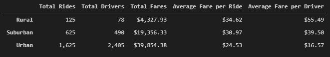
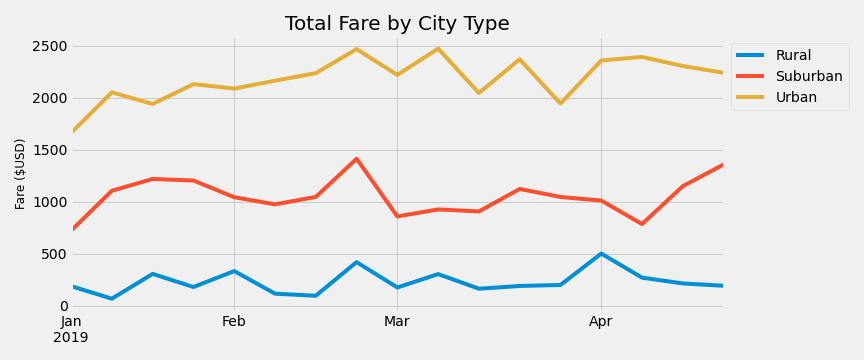

# PyBer Ridesharing Data Analysis
Analysis using ipython notebooks to merge, summarize, and visualize data relating to "PyBer" ridesharing revenue across Urban, Suburban, and Rural regions over the same period of time.

## Overview
After performing an EDA on the provided data (see PyBer.ipynb) and performing bubble plot, box-and-whiskers, and pie chart visualizations on the data, management has requested a visualization comparing weekly revenues across the three region classifications for all rides occuring between Jan 1 2019 and April 29 2019. As this analysis works towards that visualization, we will create and clean some summary statistics for each region type to compare differences in key metrics.

## Results
### Summary Statistics
The first step towards the singular visualization showing regional differences over time is to establish a big-picture level understanding of the available data. To do so, we'll group the ride data by region and assess differences in two important metrics: Average Fare per Ride and Average Fare per Driver.

Below is a summary dataframe created using all provided data:



### Differences in Total Rides and Drivers
Looking at the difference in the first two columns (Total Rides, Total Drivers) we can immediately see that the three regions represent very different amounts of the total logged rides. Urban rides make up a large majority of all rides (over 68%!) while rural rides only make up about about 5% of app uses. The total drivers statistics are similarly skewed towards the urban region, with 80% of all drivers being in Urban regions.

### Differences in the ratio of Rides to Drivers
In urban areas, there are more drivers than total rides - this suggests that many of the registered drivers did not drive for any of the rides within the data's timeframe (the first few months of 2019). Let's compare that to the ratio of rides and drivers for the rural and suburban regions: less drivers than total rides means that at least one (likely, many) of the rural and suburban drivers performed multiple rides within the logged data.

### Differences in Fare per Ride
As we might expect, Average Fare per Ride is highest for rides in rural regions, lower for suburban and lowest for urban regions. Assuming that fare pricing is a function of "distance" and "rate per mile", this suggests two potential factors, although there's not enough data here to assert causality: 
1. (Distance) Rural communities are often spaced out over a larger distance to facilitate farmland, so rides in rural regions could average longer by distance/time than urban rides; or
2. (Rate per Mile) There may be less competition for PyBer in rural communities, and perhaps Pyber uses a smart algorithm to raise fare rates by location type

### Differences in Fare per Driver
The skew of Average Fare per Driver across these three regions tracks the largest differences we've touched on. Since there are more drivers working less expensive rides in urban areas, the average fare per driver is lower in those areas. Since there are less drivers working more expensive rides in rural areas, the average fare per driver is significantly higher there (by more than 3x!). 

## Checks Before Visualizing
This analysis has been tasked with visualizing data from Jan 1 2019 - April 29 2019. To make sure we can present the visualization for this period alongside the summary stats for the entire dataset, we'll take a moment to check how much of the data we'll exclude by filtering into the given date range. 

```
# Check if there is data outside of specified range (Jan 1 2019 : April 29 2019)
earliestDate = pyber_data_df["date"].min()
latestDate = pyber_data_df["date"].max()
print(f"The earliest data is from {earliestDate}.\nThe latest data is from {latestDate}.")
```
The output is:
```
The earliest data is from 2019-01-01 00:08:16.
The latest data is from 2019-05-08 13:10:18.
```
So we know that there's no data before the beginning of the visualized period, but are there a significant amount of records between 4/29 and 5/8 that could cause discrepancies between what we see in the summary table vs. the visualization?

```
# Check how much data falls beyond the end of the range
records_outside = pyber_data_df.loc[(pyber_data_df["date"] >= '2019-04-29'),"ride_id"].count()
total_rides = pyber_data_df["ride_id"].count()
percent_outside = records_outside / total_rides * 100
print( f"Of {total_rides} rides, {records_outside} occur after April 28 2019.",
        f"{percent_outside:0.2f}% of the data is beyond the specified date range.")
```
The output is:
```
Of 2375 rides, 179 occur after April 28 2019. 7.54% of the data is beyond the specified date range.
```

As expected, most of the data we used to create the summary dataframe is within the specified date range. As a last easy check, we can see how many % of the total days represented in the data falls outside of the specified range:
```
Jan 1 to April 29: 118 days
Jan 1 to May 8: 127 days
% of days not visualized: ~7.09%
```
Very close to what we expected! To reiterate what we've just checked, the percentage of records that we're not including in the visualization is roughly equal to the percentage of days we're not including.

There is still the possibility that an outlier we wouldn't see in the visualization could be skewing the summary results. Consider that a record could exist on May 2 2019, where a rural fare was logged as "$3645.00" instead of "$36.45". This would not have been detected by the previous tests, and could skew the rural summary heavily due to how few records exist in that category. For now, we can be confident we're not ignoring interesting data for the purpose of our visualization.

## Visualizing Differences in Regional Revenue Over Time
Now that we have established that a filtered visualization can be presented with our summary statistics, let's take a look:



It looks like the overall revenue heirarchy holds true in any week within the provided data: Urban regions are PyBer's biggest earners, then Suburban, then Rural. There are two trends present that we can observe:
1. **There is an uptick for Urban and Suburban regions between the first and second week of January**

It's important to note that ```resample("W")``` tracks weeks as starting on Sunday by default. This fact has implications that could affect this observation:
January 1, 2019 was a Tuesday - that means that the first data point for all lines is missing 2 out of the 7 days of the week (Sunday and Monday) that are normally included in the weekly total, which could explain why those points are relatively low for Urban and Suburban regions.

2. **There is an uptick in all regions between the third and fourth week in February**

An easy first-glance opinion could be that somehow Valentine's Day rides has been counted in the fourth week of February, but not even the resample() oddity described above could have shifted the weeks that much. The only major holiday that falls within that fourth week (Feb 17-23) seems to be President's Day, which is not a holiday we might expect to be big revenue day for a ridesharing app... at least, not more than Valentine's Day. We'll include this "President's Day spike" mystery in the summary below.

## Summary
The following recommendations are based on the results described above:

1. Recommend getting a more accurate count of active drivers to enhance usefulness of Average Fare per Driver statistics. There is evidence that the counts of drivers per city includes drivers that did not perform any rides over the given period. 

2. Related to #1, recommend further analysis to identify driver categories. It's possible that a small amount of drivers are responsible for a majority of performed rides, or that many drivers perform one ride and then delete the app.

3. Recommend a similar visualizaton focusing on change in Average Fare by week per region. Could be helpful to display both on the same graph, using two different y-axes.

4. Recommend rebuilding fare visualization using ```resample("W-TUE")```, to make sure the first data point shown in the visualization isn't misleading. 

5. Recommend further investigation into the President's Day spike. This is one of the highest-earning weeks of the first quarter across all regions, and identifing the cause may suggest opporunities to improve revenue during the rest of the year.